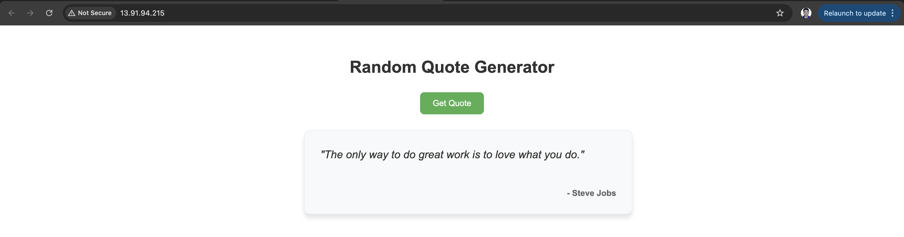
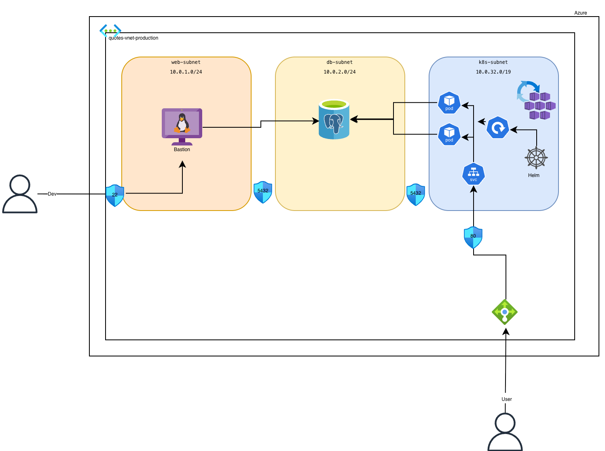

# Random Quote Generator

A cloud-native web application that displays random inspirational quotes. Built with Go, PostgreSQL, and deployed on Azure Kubernetes Service (AKS) using Terraform.

## Application Screenshot



## Architecture Diagram



## Tech Stack

- **Backend**: Go
- **Frontend**: HTML/CSS/JavaScript
- **Database**: PostgreSQL
- **Infrastructure**: Azure AKS, Terraform
- **Deployment**: Helm Charts

## AI-Assisted Development

AI tools were used to accelerate development in the following areas:
- HTML/CSS interface development and formatting.
- Variable formatting and structuring across codebase
- Makefile creation for local testing workflow to avoid back-and-forth during development
- writing README.md

## Local Development

### Quick Start

```bash
cd application
make dev
```

This command starts PostgreSQL in Docker, waits for the database, and runs the application.

Access the app at: `http://localhost:8080`

### Infrastructure

```bash
./terraform.sh init
./terraform.sh apply
```

### Application

```bash
cd helm-charts
helm install quotes-app . -f values.yaml
```

## Project Structure

```
quotesapp/
├── application/           # Go application
│   ├── cmd/              # Main entry point
│   ├── internal/         # Internal packages
│   ├── Makefile          # Local development commands
│   └── docker-compose.yaml
├── infra/                # Terraform infrastructure
│   └── production/
├── modules/              # Terraform modules
└── helm-charts/          # Kubernetes manifests
└── images/               # arch diagram and application image
```

## API Endpoints

| Endpoint | Description |
|----------|-------------|
| `/` | Web interface |
| `/api/quote` | Get random quote (JSON) |
| `/health` | Health check |
